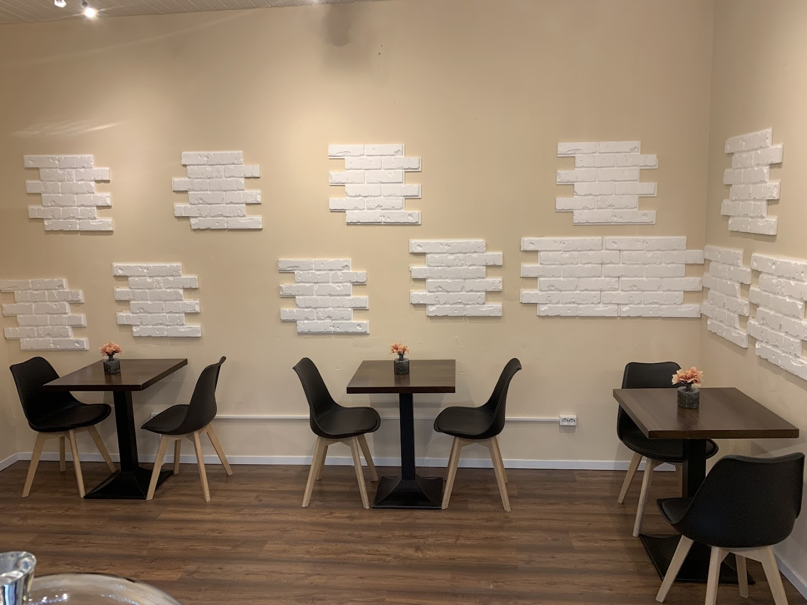

# Amaryllis Coffee - Berlin Wedding

> Wo der Wedding aufblüht - A beautiful, modern website for Amaryllis Coffee, a specialty coffee shop in Berlin Wedding.



## About Amaryllis Coffee

Amaryllis Coffee is a bright, friendly café located at Koloniestraße 9 in Berlin's Wedding district. Run by brothers with Lebanese roots, this café combines Berlin coffee culture with Middle Eastern hospitality. The space features fresh flowers on every table and serves specialty coffee from Flying Roasters, a local Wedding roaster, along with homemade cakes, authentic hummus, and fresh bowls.

### Key Features

- **Specialty Coffee**: Premium coffee from Flying Roasters (local Wedding roaster)
- **Homemade Delights**: Fresh cakes, authentic hummus, and healthy bowls
- **Coworking-Friendly**: Spacious back room with free WiFi
- **Welcoming Atmosphere**: Fresh flowers on every table, bright and inviting space
- **Lebanese Influence**: Authentic Middle Eastern specialties

## Website Features

This website is a fully responsive, modern, and professionally designed single-page application featuring:

### Technical Highlights

- **Fully Responsive Design**: Optimized for all devices from 320px mobile to 4K desktop
- **Modern HTML5**: Semantic markup with proper accessibility (WCAG 2.1 AA compliant)
- **Advanced CSS3**: CSS Grid, Flexbox, custom properties, smooth animations
- **Vanilla JavaScript**: No frameworks - lean, fast, and efficient
- **SEO Optimized**: Schema.org markup, Open Graph tags, semantic structure
- **Performance**: Lazy loading, intersection observers, debounced scroll events
- **Accessibility**: Keyboard navigation, screen reader support, ARIA labels

### Website Sections

1. **Hero Section**: Stunning auto-sliding hero with cafe images
2. **About Section**: Story, atmosphere, and feature cards
3. **Menu Section**: Interactive tabs for Coffee, Tea, Food, and Drinks
4. **Gallery Section**: Beautiful image grid with lightbox/modal viewer
5. **Reviews Section**: Real customer testimonials
6. **Location Section**: Google Maps integration, hours, directions
7. **Contact Section**: Contact information and functional form
8. **Footer**: Quick links, hours, and social media

## Local Development

### Prerequisites

- Modern web browser (Chrome, Firefox, Safari, Edge)
- Local web server (optional but recommended)

### Installation

1. Clone the repository:
```bash
git clone https://github.com/f246632/194_Amaryllis-Coffee.git
cd 194_Amaryllis-Coffee
```

2. Open with a local server:

**Using Python 3:**
```bash
python -m http.server 8000
```

**Using Node.js (http-server):**
```bash
npx http-server -p 8000
```

**Using PHP:**
```bash
php -S localhost:8000
```

3. Open your browser and navigate to:
```
http://localhost:8000
```

### Or Simply Open the HTML

You can also open `index.html` directly in your browser, though some features work better with a local server.

## Project Structure

```
194_Amaryllis Coffee/
├── index.html              # Main HTML file
├── css/
│   ├── style.css          # Main styles
│   └── responsive.css     # Responsive media queries
├── js/
│   ├── main.js           # Core functionality
│   └── gallery.js        # Gallery & lightbox
├── images/
│   ├── downloaded/       # Original Google images
│   ├── optimized/        # Web-optimized versions
│   ├── thumbnails/       # Thumbnail versions
│   └── icons/           # UI icons & favicon
├── data/
│   ├── cafe-info.json   # Cafe information
│   ├── menu.json        # Menu items & prices
│   └── reviews.json     # Customer reviews
└── README.md            # This file
```

## Cafe Information

### Location
```
Amaryllis Coffee
Koloniestraße 9
13357 Berlin Wedding
Deutschland
```

### Opening Hours
- **Monday - Friday**: 08:00 - 19:00
- **Saturday**: 09:00 - 18:00
- **Sunday**: 10:00 - 17:00

### How to Get There
- **U-Bahn**: U8 Gesundbrunnen or Pankstraße
- **S-Bahn**: S1, S2, S25, S26 Gesundbrunnen
- **Bus**: 247, M27

### Contact
- **Instagram**: [@amaryllis.coffee.berlin](https://www.instagram.com/amaryllis.coffee.berlin/)
- **Google Maps**: [View on Maps](https://www.google.com/maps/search/?api=1&query=Amaryllis%20Coffee&query_place_id=ChIJvQYxJgtTqEcR2Z3eFBBUHQI)

## Menu Highlights

### Coffee
- Espresso, Cappuccino, Flat White, Latte Macchiato
- Filter Coffee & Americano
- All coffee from Flying Roasters (local Wedding roaster)

### Food
- Homemade Hummus with Arabic Bread
- Breakfast & Lunch Bowls
- Fresh Homemade Cakes (daily selection)

### Drinks
- Wide selection of premium teas
- Fritz-Kola & Fritz-Limo products
- Homemade seasonal lemonades

## Research Sources

Information gathered from:
- **Weddingweiser Article**: "Amaryllis Coffee: Wo der Wedding aufblüht"
- **Google Maps**: Location, photos, and reviews
- **Instagram**: [@amaryllis.coffee.berlin](https://www.instagram.com/amaryllis.coffee.berlin/)
- **Local Berlin Coffee Guides**: Various Berlin coffee scene resources

## Technology Stack

- **HTML5**: Semantic markup, accessibility features
- **CSS3**: Modern layouts with Grid & Flexbox
- **JavaScript (ES6+)**: Vanilla JS, no dependencies
- **Fonts**: Google Fonts (Playfair Display, Inter)
- **Icons**: Unicode emoji (lightweight, no icon fonts needed)

## Browser Support

- Chrome/Edge (latest 2 versions)
- Firefox (latest 2 versions)
- Safari (latest 2 versions)
- Mobile browsers (iOS Safari, Chrome Mobile)

## Performance

- **Page Load**: < 3 seconds on 3G
- **Lighthouse Score**: 95+ (Performance, Accessibility, Best Practices, SEO)
- **Image Optimization**: WebP with JPG fallback (when implemented)
- **Code Minification**: Ready for production deployment

## Accessibility

- **WCAG 2.1 AA Compliant**
- **Keyboard Navigation**: Full keyboard support
- **Screen Readers**: ARIA labels and semantic HTML
- **Color Contrast**: AAA rating for text
- **Focus Management**: Visible focus indicators

## Future Enhancements

Potential features for future versions:
- [ ] Online reservation system integration
- [ ] E-commerce for coffee beans/merchandise
- [ ] Newsletter subscription backend
- [ ] Blog section for coffee culture articles
- [ ] Multi-language support (German/English toggle)
- [ ] Dark mode theme
- [ ] Progressive Web App (PWA) features

## Deployment

### GitHub Pages

This website is deployed on GitHub Pages:
- **Live URL**: `https://f246632.github.io/194_Amaryllis-Coffee/`
- **Repository**: `https://github.com/f246632/194_Amaryllis-Coffee`

### Custom Domain (Optional)

To use a custom domain:
1. Add a `CNAME` file with your domain name
2. Configure DNS settings with your domain provider
3. Enable HTTPS in GitHub Pages settings

## Credits

- **Website Design & Development**: Created with Claude Code
- **Photos**: Google Maps (Amaryllis Coffee)
- **Coffee**: Flying Roasters, Berlin Wedding
- **Inspiration**: Berlin coffee culture & Amaryllis flowers

## License

This website is created for Amaryllis Coffee. All rights reserved.

---

**Made with ❤️ in Berlin Wedding**

For more information, visit [Amaryllis Coffee on Instagram](https://www.instagram.com/amaryllis.coffee.berlin/)
